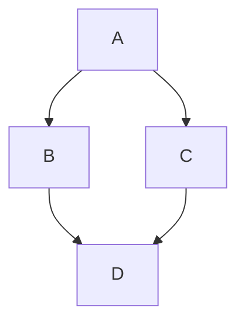

# Пример страницы документации

Эта страница используется для демонстрации плагинов и стилей, доступных в этом экземпляре `mdbook`.

Лучше всего просматривать исходный markdown этой страницы, что можно сделать с помощью кнопки в правом верхнем углу, нажав 'Code' вместо 'Preview' на GitHub.

## markdown

Для этого лучше всего обратиться к [общему руководству по markdown](https://www.markdownguide.org/getting-started/)! Там много всего.

**жирный**

*курсив*

~~зачёркнутый~~

## шаблоны

Вы также можете передавать аргументы в вызов шаблона, которые интерполируются на страницу с помощью `mdbook-template`. См. [их документацию](https://github.com/sgoudham/mdbook-template#format) для получения дополнительной информации

`\{\{#template {link to template file}\}\}`

{{#template ../templates/outdated.md}}

{{#template ../templates/wip.md}}

{{#template ../templates/stub.md}}

## admonish-блоки

Все доступные типы admonish.

Чтобы использовать admonish:
``````
```admonish {type} "{text you want as title, or leave blank}"
description
```
``````

```admonish note
```

```admonish abstract
```

```admonish info
```

```admonish tip
```

```admonish success
```

```admonish question
```

```admonish warning
```

```admonish failure
```

```admonish danger
```

```admonish bug
```

```admonish example
```

```admonish quote
```

## latex
Блочный LaTeX:

\\[ \mu = \frac{1}{N} \sum_{i=0} x_i \\]

Встроенный LaTeX:

Глупый мейнтейнер атмосферики, вывод записан на \\( \LaTeX \\), значит, это обязано быть правдой!

## mermaid


