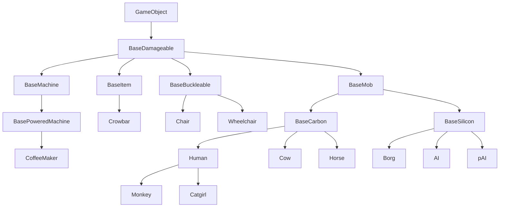
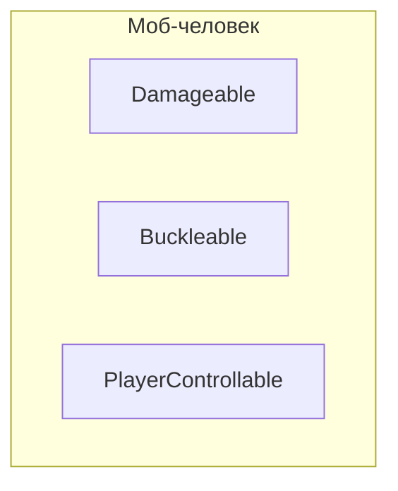
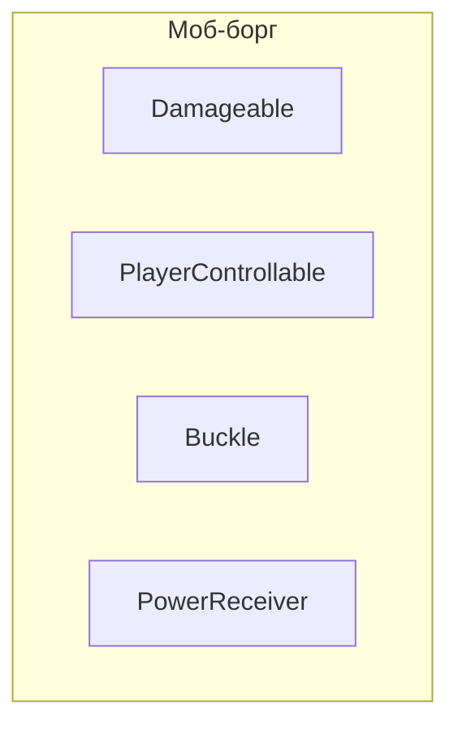
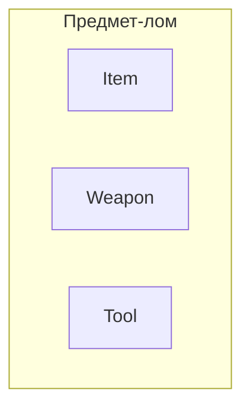
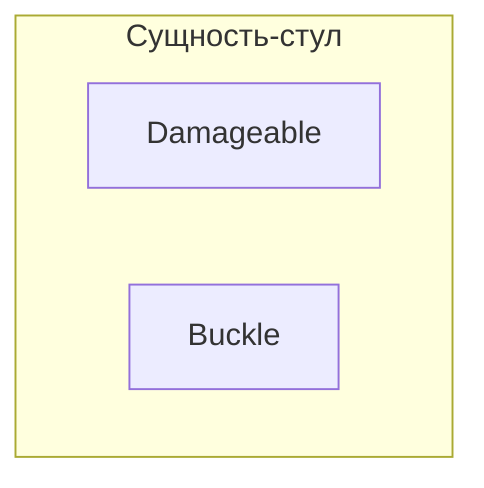
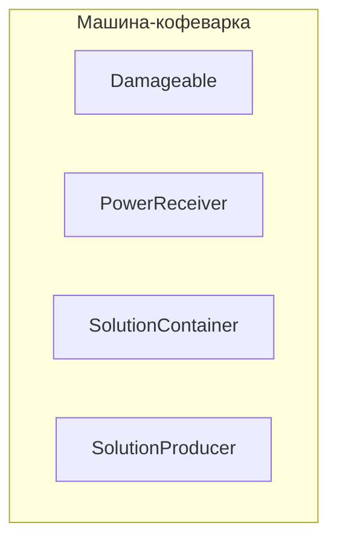

# ECS

Красиво вставьте это куда-нибудь.

https://youtu.be/W3aieHjyNvw

https://youtu.be/JxI3Eu5DPwE

## Решение для «ООП — это плохо»: ECS

Итак, банда ECS ([Entity Component System](https://en.wikipedia.org/wiki/Entity_component_system)) наконец убедила вас, что ООП плох, а ECS хорош, да?
Отлично! ООП и вправду плох. В этом документе мы пересмотрим некоторые базовые концепции, такие как компоненты, системы сущностей и события, и изучим подход ECS к ним.

```admonish info
Чтобы увидеть основательный, реальный пример ECS в действии в нашей кодовой базе, взгляните на [Stacks](https://github.com/space-wizards/space-station-14/pull/4046) и [Actors](https://github.com/space-wizards/RobustToolbox/pull/1774).
```

## Почему композиция вместо наследования для игровых объектов?
Когда вы думаете о том, как проектировать игровые объекты, такие как люди, предметы или стены, вашей первой идеей может быть использование сложных деревьев наследования:



На первый взгляд кажется нормальным, правда?
Однако по мере добавления всё большего количества возможностей вы вскоре осознаете ограничения этого подхода. Давайте разберём некоторые проблемы, с которыми вы можете столкнуться.

1. Допустим, вы хотите заставить боргов, но не ИИ и не пИИ, получать питание из энергосети так, как это умеет `BasePoweredMachine`.
Что вы будете делать? Заставите боргов наследоваться от `BasePoweredMachine`?
Это не вариант, поскольку им нужно наследоваться и от `BaseMob`, и от `BaseSilicon`.
Может, вместо этого заставить `BaseMob` наследоваться от `BasePoweredMachine`?
Это тоже не имеет смысла, большинству мобов эта функциональность не нужна.
Здесь вам остаётся только дублировать код, обрабатывающий питание, между `BaseMachinePowered` и `Borg`.
2. Теперь допустим, вы хотите позволить людям пристёгиваться к лошадям и боргам, но не к остальным мобам.
Что вы сделаете, заставите `BaseMob` наследоваться от `BaseBuckleable`?
Это не имеет смысла, большинству мобов эта функциональность не нужна.
И снова вам остаётся только дублировать код между несколькими далёкими друг от друга классами.

Как мы увидели, наличие таких сложных деревьев наследования не идеально и в конце концов вынуждает нас без надобности дублировать код или наделять некоторые игровые объекты функциональностью, которая им никогда не понадобится.
Решение всех этих проблем — использовать вместо этого **композицию**.











Как видите, благодаря использованию композиции все наши прежние проблемы аккуратно решаются без дублирования кода и с возможностью лучшей поддерживаемости и расширяемости:
- Борги и кофеварки используют общий компонент `PowerReceiver`, который даёт им возможность получать питание из сети.
- Борги и стулья используют общий компонент `Buckle`, который позволяет пристёгивать к ним сущности с `Buckleable`, например людей.
- Люди и борги используют общий компонент `PlayerControllable` (также известный в коде SS14 как `Mind`), который позволяет игроку управлять ими...
- А большинство игровых объектов выше используют общий `Damageable`, который позволяет им иметь «здоровье» и получать урон.

TODO: дописать это
----

Отредактируйте весь этот текст до чего-то подобающего документу... Вздох.

Ладно, обычно под «ООП плохо» мы подразумеваем кучу вещей, и я не уверен, как сжать всё это в простое объяснение, но приступим.
1. Прежде всего, наследование. Со сложными деревьями наследования связано много проблем и негибкости... Представьте, что у нас нет компонентов, а есть огромное дерево наследования: если бы у вас был базовый класс «машина» с энергопотреблением и другой базовый класс «моб» с забавными механиками управления игроком, то по сути вы не могли бы сделать моба с качествами машины или наоборот без уродливых хаков либо без общего базового класса для «машины» и «моба». Но в то же время это тоже не имело бы особого смысла! Большинству мобов не нужны «функции энергопотребления», а машины вообще редко бывают управляемыми игроком... Поэтому, чтобы решить эту ужасную, запутанную проблему, мы используем «композицию» (компоненты!) вместо наследования. Вы это уже знаете: если вы хотите, чтобы у сущности были руки, добавьте `HandsComponent`. Если вы хотите, чтобы она потребляла энергию, поможет `PowerConsumerComponent`! Если вы хотите сделать её управляемой игроком, добавьте `MindComponent` и управляйте сущностью, и... о, эй, мы сделали «киборга-моба» из переиспользуемых, обобщённых компонентов! Это, конечно, трудно сделать с помощью одного лишь огромного дерева наследования... Разумеется, наследование может быть хорошим и уместным для мелких вещей или когда у вас очень маленькое и самодостаточное дерево наследования (см., например, что-то вроде `SoundSpecifier`, оно крошечное, но наследование там очень помогает), но когда у вас большая сложная игра вроде ss14, наследование просто делает всё намного болезненнее.
2. Кроме того, есть ещё инкапсуляция. ООП любит помещать и данные, и методы/логику в один класс как единый пакет и открывать наружу лишь определённые вещи этого класса. Ну, знаете, забавные модификаторы доступа вроде `public`, `private` и тому подобное? Так вот, инкапсуляция хороша для чего-то вроде движка, которому действительно нужно скрывать/запрещать доступ к некоторым данным или методам. Но для игровых данных и логики она, например, не имеет настолько большого смысла. У `StackComponent` в SS14 нет приватных полей или свойств, любой волен читать/записывать значения как ему угодно. Однако это совсем не рекомендуемый способ взаимодействия со стеками!
`StackSystem` имеет несколько методов для работы с `StackComponent` и изменения его значений. Так, чтобы использовать определённое количество предметов из стека, вы вызываете `StackSystem.Use`, чтобы разделить его — `StackSystem.Split` и т. д., и `StackSystem` позаботится обо всём за вас. Потому что оказывается, что изменить значение количества в стеке недостаточно. Нужно ещё сделать забавные вещи, такие как: пометить компонент как грязный для синхронизации по сети, задать значение внешнего вида, поднять событие `StackCountChanged` и т. д.
В E/C вы бы сделали это, поместив всю эту логику в свойство «amount» у `StackComponent` или, может быть, в метод. Тогда вы могли бы с помощью `private` сделать саму «amount» приватной. Однако архитектура E/C не будет принята в этой кодовой базе, впредь мы будем использовать только архитектуру ECS.

Видите ли, помещать любую логику в класс компонента вообще не имеет смысла. Если подумать о том, как устроены вещи в ECS, это выглядит так:
1. Наш игровой мир состоит из множества сущностей, у сущностей есть компоненты
2. Есть системы, которые работают с компонентами

Следовательно, компоненты должны содержать только данные и никакой логики. Системы должны придавать сущностям их поведение, когда у тех есть подходящие компоненты.
Я скорее говорю о том, что... Вместо того чтобы логика в компонентах что-то меняла, мы хотим, чтобы системы сущностей работали с компонентами и изменяли их. Так что вместо:
`HandsComponent.Pickup(ItemComponent)` у вас было бы:
`HandsSystem.Pickup(UserEntity, ItemEntity)`.


## Снова о компонентах
Ах, компоненты. Долгое время они были сердцем симуляции игры: смесь данных и логики, подобная миске, полной размокшей лапши.
Однако, как мы убедились на собственном опыте в нашей кодовой базе, масштабировать их далеко не идеально.
Через некоторое время вы начинаете получать компоненты, тесно связанные со множеством других компонентов, и в итоге получается не поддерживаемый бардак. Что вы делаете, когда компонент требует, чтобы на сущности существовал другой компонент? Добавляете его, если он отсутствует, или сообщаете об ошибке?

Решение всего этого и многого другого состоит в том, чтобы убрать ВСЮ логику из компонентов и просто рассматривать их как контейнеры для ваших данных или маркеры. В долгосрочной перспективе это означает, что все компоненты можно превратить в структуры и тем самым потенциально повысить производительность во многих областях игры.

Но постойте, если мы уберём всю логику из компонентов, как же добавить сущности поведение?
На сцену выходят *системы сущностей*.

## Системы сущностей: какими они должны были быть с самого начала
Системы сущностей, как подразумевает их название, являются системами для сущностей.
Это означает, что в конечном счёте они содержат всю логику и поведение для сущностей.

### События, подписки и методы
Системы сущностей используют *подписки на события*, чтобы получать обратные вызовы, когда происходят определённые вещи.
Например, вы можете подписаться на получение обратного вызова, когда инициализируется компонент определённого типа, и т. д.
У систем также могут быть публичные методы, которые могут вызывать другие системы сущностей, и они могут поднимать события для передачи информации. Как правило, ваши публичные методы принимают UID сущностей, компоненты и данные в качестве аргументов.

```csharp
// Система, работающая на сервере...
// Всякий раз, когда пользователь взаимодействует с сущностью, у которой есть этот компонент,
// счётчик в ней будет увеличен на ноль. Также будет поднято событие.
// Другие системы сущностей могут взаимодействовать с FooComponent через публичный API здесь.
public sealed class FooSystem : EntitySystem
{
    [Dependency] protected readonly SharedAppearanceSystem _appearanceSystem = default!;

    // Всегда подписывайтесь на события здесь, при инициализации
    public override void Initialize()
    {    
        // Подписаться на инициализацию FooComponent...
        SubscribeLocalEvent<FooComponent, ComponentInit>(OnFooInit);
        
        // Подписаться на взаимодействие пользователя с FooComponent посредством предмета.
        SubscribeLocalEvent<FooComponent, InteractUsingEvent>(Handle);
        
        // Подписаться на широковещательное событие MoveEvent, поднимаемое всякий раз,
        // когда сущность движется... Просто пример подписки
        SubscribeLocalEvent<MoveEvent>(OnEntityMove);
    }
    
    // Вызывается при инициализации FooComponent. 
    private void OnFooInit(Entity<FooComponent> ent, ref ComponentInit _)
    {
         // Инициализируйте свой FooComponent здесь
    }
    
    // Пример обработчика для взаимодействия пользователя с FooComponent.
    private void Handle(Entity<FooComponent> ent, ref InteractUsingEvent args)
    {
        // Увеличить счётчик взаимодействий на единицу
        // Мы вызываем этот метод, так как он делает всё за нас.
        SetInteractCounter((ent, ent.Comp), ent.Comp.InteractCounter + 1);
    }
    
    // Вызывается всякий раз, когда сущность движется.
    private void OnEntityMove(ref MoveEvent ev)
    {
        // Сделайте здесь что-нибудь! Хотя мы ничего не делаем, потому что это пример...
    }

    // Публичный метод, который другие системы могут вызвать для взаимодействия с FooComponent
    public void ResetInteractCounter(Entity<FooComponent?> ent)
    {
        // Мы просто вызываем наш другой метод, который делает всё за нас.
        SetInteractCounter(ent, 0);
    }

    // Публичный метод, который другие системы могут вызвать для взаимодействия с FooComponent
    public void SetInteractCounter(Entity<FooComponent?> ent, int count)
    {
        // Попытаться разрешить компонент...
        if (!Resolve(ent, ref ent.Comp))
            return;
    
        // Сохранить старое значение счётчика на потом...
        var oldCounter = ent.Comp.InteractCounter;
        
        // Установить новый счётчик взаимодействий
        ent.Comp.InteractCounter = count;
    
        // Теперь зададим данные внешнего вида, если у сущности есть компонент внешнего вида
        if (TryComp(ent, out AppearanceComponent? appearance))
            _appearanceSystem.SetData(ent, FooVisualData.InteractCounter, count, appearance);
            
        // Теперь поднимаем событие, чтобы все узнали, что InteractCounter изменился
        // Поскольку третий аргумент равен false, это событие не будет широковещательным.
        // Оно поднимается только как направленное событие! 
        RaiseLocalEvent(ent, new FooInteractCounterChangedEvent(oldCounter, ent.Comp.InteractCounter));
    }
}

[RegisterComponent]
public sealed partial class FooComponent : Component
{    
    // Это будет увеличиваться при каждом взаимодействии пользователя с нами.
    // Обратите внимание, что логика для этого не в этом компоненте, а в системе.
    [DataField]
    public int InteractCounter = 0;
}

// Событие, которое будет подниматься всякий раз, когда меняется счётчик взаимодействий FooComponent.
// Это событие неизменяемое и информационное, то есть обработчики не могут его изменить,
// и его единственная цель — сообщить о некотором событии, в данном случае об изменении значения
public sealed class FooInteractCounterChangedEvent : EntityEventArgs
{
    public int OldCounter { get; }
    public int NewCounter { get; }
    
    public FooInteractCounterChangedEvent(int oldCounter, int newCounter)
    {
        OldCounter = oldCounter;
        NewCounter = newCounter;
    }
}

[Serializable, NetSerializable]
public enum FooVisualData
{
    InteractCounter,
}
```

### Создание и использование

Когда вы создаёте новый класс, наследующий EntitySystem, или существующую систему сущностей, движок автоматически создаст и будет использовать её при запуске игры.
По сути это [синглтоны](https://gameprogrammingpatterns.com/singleton.html), то есть одновременно существует только один экземпляр системы сущностей.

### Время жизни
Системы сущностей имеют разное время жизни на сервере и на клиенте:
На сервере время жизни систем сущностей по сути совпадает со временем жизни программы.

Но на клиенте время жизни систем сущностей совершенно иное.
Системы сущностей создаются и инициализируются при подключении к серверу, а выключаются и затем удаляются, когда клиент отключается от сервера. По этой причине на клиенте всегда следует очень внимательно относиться к очистке при выключении систем сущностей. 

### Взаимозависимости

Системы сущностей могут содержать зависимости от других систем сущностей, используя атрибут `[Dependency]`, точно так же, как с IoC-менеджерами. Это предпочтительнее, чем получать другие системы сущностей вручную и кэшировать их в поле вашей системы или получать их на лету в методах. 
Стоит отметить, что зависимости от систем сущностей можно иметь только в системах сущностей.
Пример:

```csharp
public sealed class BarSystem : EntitySystem
{
    public void Doo()
    {
        // Какая-то логика здесь
    }
    
    public void Hicky()
    {
        // Какая-то логика здесь
    }
}

public sealed class FooSystem : EntitySystem
{
    // Это будет автоматически установлено при создании системы.
    [Dependency] private readonly BarSystem _barSystem = default!;
 
     // Обычные зависимости от IoC-менеджеров здесь тоже работают
    [Dependency] private readonly IPlayerManager _playerManager = default!;
 
    public override void Initialize()
    {
        // Это работает в Initialize, зависимости уже разрешены.
        _barSystem.Doo();
    }
    
    public void MyFunnyMethod()
    {
        _barSystem.Hicky();
    }
}

```


## События, или как создать сложную игру без спагетти
События позволяют системам сущностей общаться между собой, не связывая их явным образом.

В RobustToolbox есть два способа поднять (и подписаться на) событие: с помощью направленных событий и широковещательных событий.

### Направленные события
Направленные события поднимаются на конкретной сущности, и если какое-либо количество подписок на события соответствуют событию и одному из компонентов на сущности, они будут вызваны. Порядок, в котором они вызываются, при необходимости можно указать явно при подписке на направленное событие (см. «Сортированные события»).
Этот вид событий обычно предпочтителен; они гораздо производительнее и позволяют поднимать события на событиях жизненного цикла компонентов (см. ниже).

### Широковещательные события
Широковещательные события поднимаются без привязки к какой-либо конкретной сущности (если только сам экземпляр события это не указывает! Но даже в этом случае оно всё равно не является полностью «направленным»).
Системы сущностей подписываются на эти события и получают обратный вызов всякий раз, когда событие поднимается.

### Примечание: сортированные события
Как направленные, так и широковещательные подписки на события могут задавать порядок.
Точнее, они могут указать, какие типы (системы сущностей) будут обрабатывать событие до и после подписывающейся системы сущностей.

Если массивы «до» и «после» равны null, обработка события не будет учитывать сортировку для этой системы сущностей.
Сортированные подписки на события используют более медленный путь, поэтому используйте их только тогда, когда они действительно нужны.

## Паттерны событий

Теперь, когда мы знаем, как поднимать события, давайте узнаем о нескольких различных паттернах программирования и «типах» событий, с которыми вы можете столкнуться при работе с событиями! Помните, что некоторые события могут смешивать некоторые из этих паттернов или не следовать им на 100 %. Проявляйте изобретательность при создании событий!

### Неизменяемые события
Эти события неизменяемы, то есть вы не можете изменить их содержимое.

#### Событие жизненного цикла
Этот вид событий очень особенный: вы не можете создавать новые, не изменяя движок, и они всегда направленные.
Они сообщают подписчику о событии времени жизни компонента.
- **ComponentAdd** - компонент был добавлен сущности.
- **ComponentInit** - компонент был инициализирован.
- **ComponentStartup** - компонент был запущен.
- **ComponentShutdown** - компонент был выключен.
- **ComponentRemove** - компонент вот-вот будет удалён.

#### Информационное событие
Этот вид событий информирует подписчика о том, что что-то произошло.
Например: событие, поднимаемое всякий раз, когда игрок закрепляет сущность, событие, поднимаемое всякий раз, когда моб погибает...

### Изменяемые события
Эти события могут иметь как неизменяемые, так и изменяемые поля.
Системы сущностей и обработчики могут свободно изменять изменяемые поля, чтобы сообщить поднявшему событие что-либо, например результат действия, особые данные и т. д.

#### Отменяемое событие
Также известное как «событие попытки».
Эти события обычно поднимаются, чтобы позволить другим системам сущностей отменить какое-либо действие.
Например, когда игрок закрепляет машину, вы можете захотеть поднять событие попытки закрепления, которое другие системы сущностей могут отменить, если тайл занят, если моб игрока не способен закреплять и т. д. Экземпляры этих событий обычно имеют изменяемое поле «Cancelled», которое системы сущностей могут установить в true, чтобы отменить действие или событие. Другие системы сущностей вольны снять отмену, но обычно этого делать не стоит.

Чтобы использовать это, вы можете наследоваться от `CancellableEntityEventArgs`.

#### Обработанное событие
Эти события предназначены для обработки одной системой сущностей. У них есть изменяемое поле «Handled», которое обозначает, были ли они уже обработаны. Другие системы сущностей должны сотрудничать и обрабатывать их только в том случае, если они ещё не были обработаны. Вариант *события-метода* ниже.

Чтобы использовать это, вы можете наследоваться от `HandledEntityEventArgs`.

#### Обеспечивающее событие
Это событие по сути является *обработанным событием*, меняется только то, как системы сущностей с ним работают. Этот вид событий позволяет выполнить операцию над сущностью, *гарантируя*, что у неё будет определённый компонент. Если его нет, он будет добавлен системой сущностей, обрабатывающей событие.
Этот паттерн работает так: поднимается обработанное событие, как направленное, так и широковещательное. 
Это работает, потому что направленные события всегда поднимаются раньше широковещательных.

Направленная подписка всегда пометит событие как обработанное и выполнит некоторую операцию.
Широковещательная подписка в той же системе сущностей ничего не делает, если событие уже обработано. Если же оно не было обработано, она добавляет компонент сущности и вручную вызывает направленный обработчик для выполнения операции.

#### Событие-метод

**НЕ ИСПОЛЬЗУЙТЕ ЭТО, ЕСЛИ НЕ ЗНАЕТЕ, ЧТО ДЕЛАЕТЕ.**
В 99,9 % случаев вам нужно использовать методы систем сущностей вместо этого.

Этот тип событий может иметь поля «input», которые неизменяемы и задаются тем, кто поднимает событие,
поля «output», которые изменяемы и задаются тем, кто обрабатывает событие, и 
поля «input/output», которые изменяемы и могут быть заданы вызывающим и получателями. 

Например, разделение стека использует (*уже нет после восстания против событий-методов 2021 года*) (направленное) событие, у которого количество является входным полем, а nullable-сущность для только что созданного разделённого стека — выходным полем.
Однако широковещательные события, следующие этому паттерну, тоже очень полезны: чтобы создать сущность стека определённого типа, вы можете поднять широковещательное событие с типом стека в качестве входа и получить сущность в качестве выхода.

Этот вид событий идеален для некоторых сложных случаев, когда несколько систем сущностей могут захотеть выполнить логику при поднятии события, подобно обычным вызовам методов. Это позволяет системам сущностей общаться между собой без какой-либо связи, сохраняя модульность и расширяемость так, как логика в компонентах никогда бы нам не позволила. Если вам нужно расширить функциональность, вы почти всегда можете сделать это, не изменяя существующий код, так как вы можете перехватывать события или просто подписываться на них.

### События, сортируемые вручную

Иногда вам просто нужно иметь возможность разложить некоторые подписки на события по нескольким приоритетам...
~~Но, учитывая, что добавить это в базовую систему направленных событий невозможно, мы можем создать систему приоритетов сами, для нашего события.~~ Оказывается, после написания этого была добавлена настоящая система сортировки событий. Надо же! Вероятно, вам стоит использовать её вместо этого, если только вы не знаете, что делаете.

Чтобы сделать это, вместо создания одного события мы создаём два или более событий.

- BeforeDooHickyEvent
- DooHickyEvent
- AfterDooHickyEvent

Как следует из их названий, они поднимаются по порядку, создавая аккуратную систему приоритетов.
Вы даже можете смешать этот паттерн с паттерном *обработанного события*, чтобы прекратить поднятие событий следующего приоритета, если предыдущее уже было обработано.

## Лучшие практики создания событий
- Имена классов событий всегда должны заканчиваться на «Event», никогда на «Message» или что-либо ещё.
- Если ваше событие связано с сущностью и является широковещательным, у него должно быть свойство/поле, ссылающееся на сущность, чтобы широковещательные подписки могли правильно использовать событие. `RaiseLocalEvent()` по умолчанию не делает событие широковещательным, если только при его поднятии не задать параметр `broadcast` равным `true`.
- Входные параметры события всегда должны задаваться в конструкторе. Необязательные входные параметры тоже, для них используйте необязательные аргументы.
- Правильно документируйте свой класс события. Напишите, что он делает или что должен представлять. Если свойство предназначено для входного и/или выходного параметра, укажите это в комментарии.

## FAQ по ECS
**В**: В чём разница между E/C и ECS?
**О**: Архитектура E/C была популяризирована в 2003 году движком Unity. ECS+события — лучшая архитектура, чем E/C в стиле Unity. E/C использует сообщения компонентов, что подразумевает размещение логики в компонентах. ECS — это особый дизайн, оптимизированный для параллелизма и дружелюбности к кэшу. ECS понижает сущности с наличия собственного кода до простого набора компонентов и делает то же самое для компонентов, перекладывая всю работу на системы. Идея в том, что систему можно оптимизировать для выполнения её работы массово параллельным образом, а сами системы могут выполняться параллельно с разрешением зависимостей.

**В**: Так почему компоненты не используют инкапсуляцию? (то есть приватные члены.)
**О**: Прежде всего, компоненты не могут использовать инкапсуляцию, потому что тогда в них была бы логика, что противоречило бы принципам ECS, которых мы придерживаемся. Инкапсуляция не имеет смысла, когда компоненты — простые контейнеры данных, так как в них нет логики. Кроме того, если цель инкапсуляции — не дать программистам напрямую изменять внутренние члены компонентов вместо обращения через конкретные системы сущностей, то есть лучшие способы это предотвратить.
Документирование/комментирование кода, проверка PR и использование новых атрибутов `Friend`.

**В**: Почему интерфейсы в компонентах были заменены системами и событиями?
**О**: Использование интерфейсов имело очень плохую производительность, события и системы значительно быстрее, помимо того что мощнее и проще в поддержке. Кроме того, использование интерфейсов в компонентах означало, что им нужно было содержать логику, что нарушало один из наших главных принципов ECS.

**В**: Итак, сущность — это набор компонентов с идентификатором?
**О**: Идеальная сущность — это просто идентификатор, а её компоненты хранятся в другом месте, эффективно.
Суть в дизайне, ориентированном на данные. В большинстве производительных решений идентификатор — это просто индекс в нескольких массивах, содержащих только один тип компонентов. У компонентов нет кода, нет поведения, ничего, только поля данных.
Системы должны выполнять поведение/логику.

**В**: Значит, компоненты действуют как теги?
**О**: Да. Компоненты — это хранилища данных, по сути теги с настраиваемыми данными. Системы сущностей воздействуют на компоненты и их данные.

**В**: Значит, системы просто ищут компоненты на сущностях?
**О**: И да, и нет. Идеальная система вообще не знает о сущности, она знает только компоненты, с которыми работает.

**В**: Итак, когда нужна связь между двумя компонентами, что смотрит на оба этих компонента и говорит «о, им нужно работать вместе»?
**О**: #1 Лучше изначально избегать таких отношений.
#2 У вас есть третья система (то есть у вас есть A и ASystem, B и BSystem, и вы заводите ABSystem, который получает список кортежей (A,B) для обработки).
Например, системе отрисовки игрока может потребоваться доступ к 3-4 компонентам, но это оправдано для её случая использования (например, в рогалике).

**В**: Что делает `RaiseLocalEvent`?
**О**: Оно поднимает событие локально (в противоположность сетевому). У него есть две перегрузки. Одна принимает только событие и поднимает его широковещательно. Другая принимает `EntityUid` и событие, чтобы поднять его направленно на сущность, и имеет необязательный параметр, позволяющий также поднять его широковещательно.
