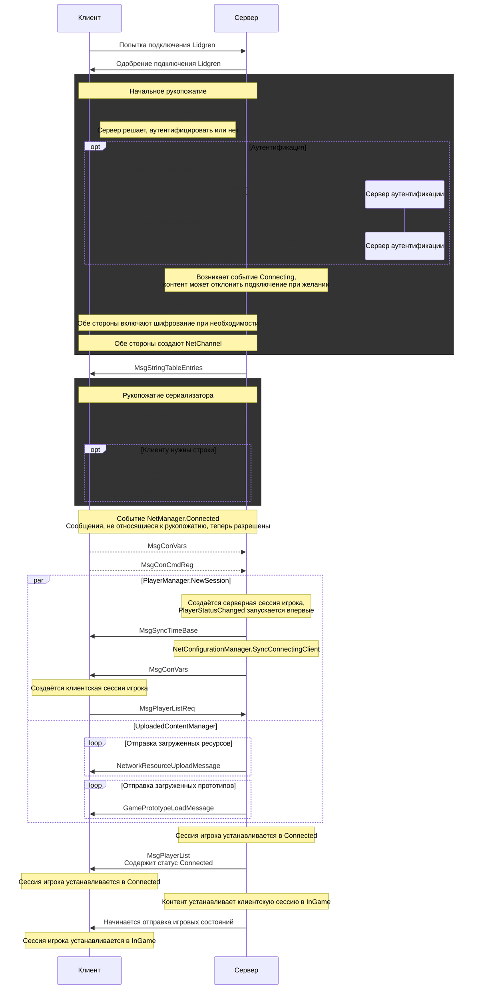

# Последовательность подключения RobustToolbox

Это полная последовательность шагов, которые выполняются при подключении клиента в RobustToolbox (и в некоторой степени в Space Station 14). Это невероятно запутанная и беспорядочная система, развивавшаяся годами и имеющая множество движущихся частей и наборов состояний. Уф.

## Базовый обзор

