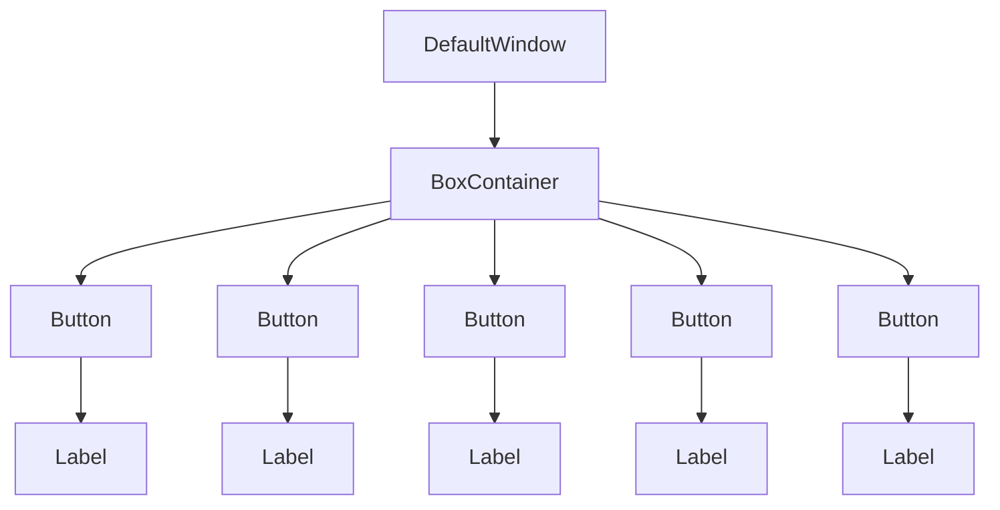

# Пользовательский интерфейс

{{ #template ../templates/outdated.md }}

Мне лень придумывать изящный вступительный абзац для этой страницы. Это руководство по UI.

```admonish info
Автодополнение кода может сильно помочь в поиске доступных элементов управления и атрибутов
```

## `Control`

UI игры состоит из огромного количества `Control`. Каждый `Control` — это один элемент UI-системы. У элементов управления разные функции: некоторые — очевидные вещи вроде текстовых меток и кнопок, а другие служат для автоматического размещения элементов.


Здесь у нас базовый UI в игре. Как видите, это окно, состоящее из нескольких кнопок. Однако здесь задействован ещё один элемент управления: `BoxContainer`, который автоматически размещает кнопки одну поверх другой.

Собственно код раскладки XAML для этого UI выглядит так (на момент написания). Разумеется, вам пока не обязательно точно понимать, что здесь происходит:

```xml
<DefaultWindow xmlns="https://spacestation14.io"
            xmlns:changelog="clr-namespace:Content.Client.Changelog"
            xmlns:ui="clr-namespace:Content.Client.Voting.UI"
            Title="{Loc 'ui-escape-title'}"
            Resizable="False">

    <BoxContainer Orientation="Vertical" SeparationOverride="4" MinWidth="150">
        <changelog:ChangelogButton />
        <ui:VoteCallMenuButton />
        <Button Name="OptionsButton" Text="{Loc 'ui-escape-options'}" />
        <Button Name="DisconnectButton" Text="{Loc 'ui-escape-disconnect'}" />
        <Button Name="QuitButton" Text="{Loc 'ui-escape-quit'}" />
    </BoxContainer>
</DefaultWindow>
```

`DefaultWindow` содержит `BoxContainer`, который автоматически размещает `Button` по вертикали, а `Button` содержат `Label` для отображения текста (`Label` создаётся автоматически, чтобы код был короче). Таким образом, элементы управления UI фактически образуют дерево:



### Базовая раскладка

Правильное размещение элементов управления — пожалуй, одна из важнейших частей UI. Ручное размещение элементов управления (то есть указание позиций и размеров вручную) раздражает, создаёт проблемы при изменении размеров и т. д... Поэтому UI-система спроектирована так, чтобы вы могли легко выстраивать раскладку на основе вспомогательных элементов управления, таких как вышеупомянутый `BoxContainer`.

В этом разделе описывается, как работает раскладка для *отдельного* элемента управления. В последующих разделах подробно рассматриваются элементы управления раскладки, такие как `BoxContainer`.

Все элементы управления фактически раскладываются как набор прямоугольников. У них есть размер и позиция относительно родителя. На следующем скриншоте вы можете увидеть фактический прямоугольник одной из этих кнопок:  


(если вам интересно, это с помощью просмотрщика UI `devwindow`: введите `devwindow` в игровой консоли и перейдите на вкладку UI.)

А вот родительский `BoxContainer`, содержащий все кнопки:


Чтобы правильно понять систему раскладки, нужно объяснить несколько концепций:

У каждого элемента управления есть `DesiredSize`. По сути это «минимальное» пространство, которое элемент управления хочет иметь, чтобы правильно разместиться, не будучи обрезанным и тому подобным. Элементы управления вычисляют его на основе своего содержимого, а это содержимое, конечно, может включать *другие* элементы управления, в зависимости от того, о каком элементе идёт речь. Несколько примеров:

* `Label` (текстовая метка): фактический размер размещённого текста.
* `TextureRect` (изображение): при условии, что оно не может сжиматься, размер изображения. 
* `BoxContainer`: суммарный размер его содержимого, размещённого последовательно.
* `Button`: размер его содержимого + некоторый отступ для границы кнопки.
* сам базовый `Control`: максимум из размеров его дочерних элементов

Однако, как уже говорилось, `DesiredSize` — это только *минимум*. На практике элементы управления часто получают гораздо больше места, чем им «нужно». Даже в меню Escape внутри кнопок масса свободного горизонтального пространства, но сам текст не занимает всю ширину. Концептуально, пока UI-система размещает элементы управления, родительский элемент управления (такой как `BoxContainer`) *упорядочивает* или *выделяет* пространство своим дочерним элементам. Затем элементы управления сами решают, как им занять это пространство. В случае меню Escape `BoxContainer` выделяет элементу управления всю ширину. Поведение по умолчанию для большинства элементов управления — *растянуться*, чтобы заполнить это пространство. В результате кнопка «растягивается», чтобы соответствовать всей ширине меню.

Это поведение регулируется `HorizontalAlignment` и `VerticalAlignment` у элемента управления, что по сути означает «что делать, если у нас больше места, чем нужно». Значение по умолчанию для обоих — `Stretch`, то есть «занять как можно больше места». Также можно использовать `Center`, который центрирует элемент управления, сохраняя его как можно меньше. А ещё есть `Left`/`Top` и `Right`/`Bottom`, чтобы выровнять элемент управления по одной стороне. Давайте попробуем поэкспериментировать с `HorizontalAlignment` для различных вещей в меню Escape:

`HorizontalAlignment="Center"` для каждой из кнопок по отдельности:


<details>
  <summary>Код XAML (нажмите, чтобы развернуть)</summary>
  
  ```xml
    <BoxContainer Orientation="Vertical" SeparationOverride="4" MinWidth="150">
        <changelog:ChangelogButton  HorizontalAlignment="Center" />
        <ui:VoteCallMenuButton HorizontalAlignment="Center" />
        <Button HorizontalAlignment="Center" Name="OptionsButton" Text="{Loc 'ui-escape-options'}" />
        <Button HorizontalAlignment="Center" Name="DisconnectButton" Text="{Loc 'ui-escape-disconnect'}" />
        <Button HorizontalAlignment="Center" Name="QuitButton" Text="{Loc 'ui-escape-quit'}" />
    </BoxContainer>
  ```
</details>

`HorizontalAlignment="Left"` для каждой из кнопок по отдельности:


<details>
  <summary>Код XAML (нажмите, чтобы развернуть)</summary>
  
  ```xml
    <BoxContainer Orientation="Vertical" SeparationOverride="4" MinWidth="150">
        <changelog:ChangelogButton  HorizontalAlignment="Left" />
        <ui:VoteCallMenuButton HorizontalAlignment="Left" />
        <Button HorizontalAlignment="Left" Name="OptionsButton" Text="{Loc 'ui-escape-options'}" />
        <Button HorizontalAlignment="Left" Name="DisconnectButton" Text="{Loc 'ui-escape-disconnect'}" />
        <Button HorizontalAlignment="Left" Name="QuitButton" Text="{Loc 'ui-escape-quit'}" />
    </BoxContainer>
  ```
</details>

`HorizontalAlignment="Left"` только у самого `BoxContainer`. Это значит, что мы заставляем сам `BoxContainer` сжаться, так что он принимает ширину самой большой кнопки. Все остальные кнопки по-прежнему растягиваются, заполняя пространство `BoxContainer`, поэтому все они одного размера — размера самой большой кнопки:


<details>
  <summary>Код XAML (нажмите, чтобы развернуть)</summary>

```admonish info
Примечание: чтобы этот пример действительно работал, нужно перенести объявление `MinSize` на содержащий элемент управления. В обычном меню `MinWidth` у `BoxContainer` единолично отвечает за ширину меню, поэтому у самого `BoxContainer` нет лишнего пространства. Оборачивание его в родительский элемент управления с `MinSize` исправляет это.
```

  ```xml
    <Control MinWidth="150">
        <BoxContainer Orientation="Vertical" HorizontalAlignment="Left" SeparationOverride="4">
            <changelog:ChangelogButton  />
            <ui:VoteCallMenuButton />
            <Button Name="OptionsButton" Text="{Loc 'ui-escape-options'}" />
            <Button Name="DisconnectButton" Text="{Loc 'ui-escape-disconnect'}" />
            <Button Name="QuitButton" Text="{Loc 'ui-escape-quit'}" />
        </BoxContainer>
    </Control>
  ```
</details>

Есть и другие полезные свойства раскладки, с помощью которых можно влиять на раскладку отдельного элемента управления:

* `MinSize`/`MinWidth`/`MinHeight`: позволяет задать пользовательский минимальный размер элемента управления, который применяется поверх существующего размера, вычисленного на основе дочерних элементов.
* `MaxSize`/`MaxWidth`/`MaxHeight`: позволяет ограничить размер элемента управления.
* `SetSize`/`SetWidth`/`SetHeight`: позволяет задать конкретный размер элемента управления.
* `Margin`: позволяет задать отступ пустого пространства вокруг элемента управления.

## Общие атрибуты
Эти атрибуты присутствуют у большинства элементов управления раскладки.
### Margin
Задаёт отступ элемента управления, к которому применён этот атрибут.
Пример:
```xml
<BoxContainer Orientation="Vertical" Margin="4">
        <Label Text="Fancy label 1" />
        <Label Text="Fancy label 2" />
    </BoxContainer>
```
Этот пример задаёт равномерный отступ 4. Также можно задать стороны по отдельности:
- `Margin="<uniform>"`
- `Margin="<horizontal> <vertical>"`
- `Margin="<left> <top> <right> <bottom>"`

### Horizontal/VerticalExpand

У элементов управления есть два довольно запутанных свойства. Мы уже разбирали `HorizontalAlignment` и `VerticalAlignment` выше, но есть ещё одно похоже звучащее свойство: `HorizontalExpand` и `VerticalExpand`. Эти свойства очень странные. Честно говоря, если бы UI-система была более развитой, их бы здесь вообще не было. **Люди часто используют их, не понимая, что они на самом деле делают, так что читайте, зануда.**

Эти два свойства влияют на раскладку вашего элемента управления **только в нескольких конкретных контейнерах**: `BoxContainer`, `SplitContainer` и `GridContainer`. Если ваш элемент управления не находится в одном из них, а вы задаёте `*Expand`, ваш код автоматически неправильный.

Так что же оно делает на самом деле? Я приведу в пример `BoxContainer`. Предположим, я отредактирую меню Escape так, чтобы места было больше, чем нужно кнопкам:


<details>
  <summary>Код XAML (нажмите, чтобы развернуть)</summary>
  
  ```admonish info
  О, смотрите, меню Escape выросло с тех пор, как я в последний раз редактировал это руководство!
  ```
  
  ```xml
    <BoxContainer Orientation="Vertical" SeparationOverride="4" MinWidth="150">
        <changelog:ChangelogButton Access="Public" Name="ChangelogButton"/>
        <ui:VoteCallMenuButton />
        <Button Access="Public" Name="OptionsButton" Text="{Loc 'ui-escape-options'}" />
        <Button Access="Public" Name="RulesButton" Text="{Loc 'ui-escape-rules'}" />
        <Button Access="Public" Name="GuidebookButton" Text="{Loc 'ui-escape-guidebook'}" />
        <Button Access="Public" Name="WikiButton" Text="{Loc 'ui-escape-wiki'}" />
        <Button Access="Public" Name="DisconnectButton" Text="{Loc 'ui-escape-disconnect'}" />
        <Button Access="Public" Name="QuitButton" Text="{Loc 'ui-escape-quit'}" />
    </BoxContainer>
  ```
</details>

`BoxContainer` всегда выделяет своим дочерним элементам как можно меньше места вдоль своей главной оси. Это значит, что неиспользованное пространство не заполняется! В примере выше мы могли бы сделать окно шире по горизонтали, и кнопки стали бы шире. Но увеличение окна по вертикали просто добавляет пустое пространство.

Вот тут и вступает в игру `VerticalExpand`. Если задать элементу управления `VerticalExpand="True"`, смотрите, что произойдёт:


<details>
  <summary>Код XAML (нажмите, чтобы развернуть)</summary>
  
  ```xml
    <BoxContainer Orientation="Vertical" SeparationOverride="4" MinWidth="150" MinHeight="300">
        <changelog:ChangelogButton Access="Public" Name="ChangelogButton"/>
        <ui:VoteCallMenuButton />
        <Button Access="Public" Name="OptionsButton" Text="{Loc 'ui-escape-options'}" />
        <!-- Эй, может, именно это нужно, чтобы люди наконец прочитали правила сервера! -->
        <Button Access="Public" Name="RulesButton" VerticalExpand="True" Text="{Loc 'ui-escape-rules'}" />
        <Button Access="Public" Name="GuidebookButton" Text="{Loc 'ui-escape-guidebook'}" />
        <Button Access="Public" Name="WikiButton" Text="{Loc 'ui-escape-wiki'}" />
        <Button Access="Public" Name="DisconnectButton" Text="{Loc 'ui-escape-disconnect'}" />
        <Button Access="Public" Name="QuitButton" Text="{Loc 'ui-escape-quit'}" />
    </BoxContainer>
  ```
</details>

Ага. Теперь мы используем это пространство! `BoxContainer` на самом деле отдаёт остаток пространства кнопке правил. Вот что делает `Expand`.

Можно задать `Expand` нескольким элементам управления, и тогда расширение будет пропорционально их свойству `SizeFlagsStretchRatio`:


<details>
  <summary>Код XAML (нажмите, чтобы развернуть)</summary>
  
  ```xml
    <BoxContainer Orientation="Vertical" SeparationOverride="4" MinWidth="150" MinHeight="300">
        <changelog:ChangelogButton Access="Public" Name="ChangelogButton"/>
        <ui:VoteCallMenuButton />
        <Button Access="Public" Name="OptionsButton" Text="{Loc 'ui-escape-options'}" />
        <!-- Эй, может, именно это нужно, чтобы люди наконец прочитали правила сервера! -->
        <Button Access="Public" Name="RulesButton" VerticalExpand="True" SizeFlagsStretchRatio="1.5" Text="{Loc 'ui-escape-rules'}" />
        <Button Access="Public" Name="GuidebookButton" VerticalExpand="True" Text="{Loc 'ui-escape-guidebook'}" />
        <Button Access="Public" Name="WikiButton" Text="{Loc 'ui-escape-wiki'}" />
        <Button Access="Public" Name="DisconnectButton" Text="{Loc 'ui-escape-disconnect'}" />
        <Button Access="Public" Name="QuitButton" Text="{Loc 'ui-escape-quit'}" />
    </BoxContainer>
  ```
</details>


Повторим: `Horizontal/VerticalAlignment` и подобные изменяют поведение элемента управления в пределах отведённого ему пространства. `Horizontal/VerticalExpand` изменяет то, как родительский контейнер решает, сколько места выделить изначально. Только некоторые родительские контейнеры учитывают `Horizontal/VerticalExpand`.

## XAML UI

Сложные UI могут включать довольно много элементов управления. Раньше большинство UI создавались путём ручного построения этих глубоких деревьев элементов управления на C#. Это было отстойно. Сегодня у нас есть Технология(tm), и благодаря XamlUI всё не так отстойно. Ура!

XAML позволяет задавать деревья элементов управления на, собственно, XML. Напомним: если вы каким-то образом пропустили верхнюю половину этой страницы, это выглядит примерно так:

```xml
<DefaultWindow xmlns="https://spacestation14.io"
            xmlns:changelog="clr-namespace:Content.Client.Changelog"
            xmlns:ui="clr-namespace:Content.Client.Voting.UI"
            Title="{Loc 'ui-escape-title'}"
            Resizable="False">

    <BoxContainer Orientation="Vertical" SeparationOverride="4" MinWidth="150">
        <changelog:ChangelogButton />
        <ui:VoteCallMenuButton />
        <Button Name="OptionsButton" Text="{Loc 'ui-escape-options'}" />
        <Button Name="DisconnectButton" Text="{Loc 'ui-escape-disconnect'}" />
        <Button Name="QuitButton" Text="{Loc 'ui-escape-quit'}" />
    </BoxContainer>
</DefaultWindow>
```

### Синтаксис

По сути, XAML — это просто причудливый способ задать объекты .NET в XML. Просто большинство XAML-фреймворков (как наш) оборачивают его во множество вещей, чтобы он был особенно пригоден для UI. Это делает его как относительно простым для сопоставления с чем угодно, так и не совсем лаконичным или приятным способом писать код UI в более сложных сценариях. Ну что ж.

#### Основы XML

Можете пропустить этот кусок, если у вас есть хотя бы базовое понимание того, что такое XML. Поскольку сегодня практически каждый программист знает HTML, а это почти то же самое, вы, вероятно, уже его знаете. Но всё же вот:

Ваш XML-документ состоит из множества **тегов**. Вот пример тега:

```xml
<Foo />
```

Комментарии выглядят так:
```xml
<!-- Это комментарий! -->
```

Обратите внимание на забавные угловые скобки, обозначающие части тега, и на забавный слэш в конце (к этому мы ещё вернёмся позже).

У XML-тегов могут быть **атрибуты**. Это дополнительные свойства, которые прикрепляются к тегам. Вот пример:

```xml
<Foo Bar="Baz" A="B" />
```

XML-теги могут содержать вещи (в нашем случае: другие теги). Это подводит нас к различию между «открытыми» и «закрытыми» тегами. До сих пор я показывал только закрытые теги (заканчивающиеся на `/>`), которые не могут содержать содержимого. Открытый тег можно сделать так:
```xml
<Foo> </Foo>
```

Если у вас есть опыт с HTML: в XML любой тег может быть как открытым, так и закрытым. Кроме того, XML не допускает различных особых случаев парсера, основанных на имени тега (`<br>`, `<p>`, ...), он гораздо более последователен.

Содержимое тега располагается между этими двумя частями. Содержимым могут быть другие теги или просто обычный текст (но обычный текст сейчас не используется в нашем движке):

```xml
<Foo>
  <Bar />
  <Baz><Foo A="B" /></Baz>
</Foo>
<!-- Вы поняли идею -->
```

#### Пространства имён

Поскольку XAML сопоставляется с реальными типами .NET (по большей части), для разрешения типов нужно импортировать пространства имён. Это делается путём указания атрибута `xmlns` у верхнего тега в документе. `xmlns="..."` — это пространство имён, используемое по умолчанию (например, `<Button>`), тогда как `xmlns:foo="..."` позволяет импортировать дополнительные пространства имён, которые можно подключить, добавив к имени тега префикс `foo:`, вот так: `<foo:Button>`. Эти пространства имён задаются не простыми именами пространств имён C#, всё довольно сложно и включает URI и прочее. Просто оставьте `xmlns="https://spacestation14.io"` для пространства имён движка, а остальные импортируйте копированием и базовым распознаванием образцов, полагаю. Некоторые примеры, которые я вытащил из случайного XAML-файла:

```xml
<Control xmlns="https://spacestation14.io"
         xmlns:x="http://schemas.microsoft.com/winfx/2006/xaml"
         xmlns:gfx="clr-namespace:Robust.Client.Graphics;assembly=Robust.Client"
         xmlns:parallax="clr-namespace:Content.Client.Parallax"
         xmlns:style="clr-namespace:Content.Client.Stylesheets">
```

#### Основной синтаксис

Каждый XML-тег представляет один объект. Так, `<Button />` просто создаёт пустую, простую `Robust.Client.UserInterface.Controls.Button` так же, как вы бы сделали `new Button()`. Вы можете задать свойства создаваемых объектов с помощью атрибутов тега, вот так:

```xml
<Button Text="Click me!" Margin="4" />
```

Вы можете заставить элементы управления содержать другие элементы управления ([помните, это дерево!](#the-control)), вкладывая их друг в друга, вот так:

```xml
<BoxContainer Orientation="Vertical" SeparationOverride="4" MinWidth="150">
  <changelog:ChangelogButton />
  <ui:VoteCallMenuButton />
  <Button Name="OptionsButton" Text="{Loc 'ui-escape-options'}" />
  <Button Name="DisconnectButton" Text="{Loc 'ui-escape-disconnect'}" />
  <Button Name="QuitButton" Text="{Loc 'ui-escape-quit'}" />
</BoxContainer>
```

Содержимое атрибутов автоматически преобразуется в тип свойства. Для простых вещей вроде чисел, строк, перечислений и т. д... это довольно очевидно. Для таких типов, как `Vector2` и `Thickness` (используется для отступов), это разделённые пробелами числа.

Вы также могли заметить забавную штуку `{Loc 'ui-...'}`. Она называется **расширением разметки**. Если кратко, это магия, которую можно вставлять в свойства для выполнения особых действий. В данном случае `{Loc 'key'}` ищет [локализованную строку](../ss14-by-example/fluent-and-localization.md).

### Использование

Чтобы *использовать* XAML для нового элемента управления, нужно создать файл с именем `FooControl.xaml`, а затем поместить соответствующий код C# в `FooControl.xaml.cs`. Как минимум нужно вызвать `RobustXamlLoader.Load(this);` где-нибудь в конструкторе объекта. Если вы хотите поддержку code-behind (свойств `Name` у объявленных элементов управления), вам потребуется сделать класс C# `partial` и добавить к нему атрибут `[GenerateTypedNameReferences]`. Полный пример выглядит так: 

```xml
<!-- FooControl.xaml -->
<Control xmlns="https://spacestation14.io">
  	<Button Name="PressButton" Text="Click me!" />
</Control>
```

```cs
// FooControl.xaml.cs
[GenerateTypedNameReferences]
public partial class FooControl : Control
{
    public FooControl()
    {
    		RobustXamlLoader.Load(this);
        PressButton.OnPressed += _ => Logger.Debug("Foo");
    }
}
```

```admonish info
Иногда свойства code-behind (`PressButton` в примере выше) могут не сгенерироваться вашей IDE. На момент написания прошёл уже год, а генераторы исходного кода всё ещё очень кривые, ура. Обычно перезагрузка проекта или сборка, вероятно, исправят это.

Похоже, Rider 2022.1 EAP3 наконец исправил многие из этих проблем. Убедитесь, что у вас актуальная версия.
```

Код XAML автоматически компилируется в IL, чтобы его можно было эффективно создавать во время выполнения. Связь между XAML-файлом и классом C# устанавливается по расположению и имени. При необходимости вы можете указать класс для использования прямо в XAML с помощью объявления `x:Class`, вот так:

```xml
<Control xmlns="https://spacestation14.io"
         xmlns:x="http://schemas.microsoft.com/winfx/2006/xaml"
         x:Class="Content.Client.UserInterface.FooControl">
		<!-- Код UI -->
</Control>
```

## UI-контроллеры
UI-контроллеры отвечают за создание, обновление и удаление элементов управления. Системы сущностей не должны делать это сами.  
Любые используемые ими данные должны быть получены путём привязки их методов к событиям системы (см. пример ниже) или путём вызова методов у IoC-сервисов, таких как IPlayerManager.  
Чтобы создать новый UI-контроллер, создайте новый класс, наследующий `UIController`. Затем этот тип будет автоматически создан как синглтон менеджером `UserInterfaceManager`.  
Виджеты извлекаются внутри UI-контроллеров путём вызова `UIManager.GetActiveUIWidgetOrNull<T>()`, где T — виджет, например `ActionsBar`.  
Жизненный цикл UI-контроллера длиннее, чем у систем сущностей; UI-контроллер может существовать до загрузки систем сущностей и оставаться живым после их выгрузки.

### Зависимости
UI-контроллер может иметь зависимости от других IoC-сервисов и контроллеров, используя синтаксис \[Dependency\].  
Для систем вместо этого нужно использовать \[UISystemDependency\].  
После загрузки систем методы UI-контроллера можно привязывать к объявленным в них событиям.

```cs
public sealed class ActionUIController : UIController, IOnSystemChanged<ActionsSystem>, IOnStateEntered<GameplayState>
{
    // Dependency используется для IoC-сервисов и других контроллеров
    [Dependency] private readonly GameplayStateLoadController _gameplayStateLoad = default!;

    // Для систем сущностей вместо этого используется UISystemDependency
    [UISystemDependency] private readonly ActionsSystem? _actions = default!;

    private ActionsWindow? _window;

    public override void Initialize()
    {
        base.Initialize();

        // Мы можем привязывать методы к полям событий других UI-контроллеров во время инициализации
        _gameplayStateLoad.OnScreenLoad += LoadGui;
        _gameplayStateLoad.OnScreenUnload += UnloadGui;

        // UI-контроллеры также могут подписываться на локальные и сетевые события сущностей
        // Локальные события — это события, поднимаемые на клиенте с помощью RaiseLocalEvent
        // SubscribeLocalEvent<PlayerAttachedEvent>(ev => {});

        // Сетевые события — это события, поднимаемые сервером и отправляемые клиенту
        // SubscribeNetworkEvent<PlayerAttachedEvent>(ev => {});
    }

    private void LoadGui()
    {
        DebugTools.Assert(_window == null);
        _window = UIManager.CreateWindow<ActionsWindow>();
        LayoutContainer.SetAnchorPreset(_window, LayoutContainer.LayoutPreset.CenterTop);
    }

    private void UnloadGui()
    {
        if (_window != null)
        {
            _window.Dispose();
            _window = null;
        }
    }

    private void ToggleWindow()
    {
        if (_window == null)
            return;

        if (_window.IsOpen)
        {
            _window.Close();
            return;
        }

        _window.Open();
    }

    public void OnSystemLoaded(ActionsSystem system)
    {
        // Мы можем привязываться к полям событий систем сущностей, когда эта система сущностей загружена
        system.LinkActions += OnComponentLinked;
    }

    public void OnSystemUnloaded(ActionsSystem system)
    {
        // И отвязываться, когда система выгружена 
        system.LinkActions -= OnComponentLinked;
    }

    // Это будет вызвано, когда ActionsSystem поднимает событие в своём поле событий LinkActions
    private void OnComponentLinked(ActionsComponent component)
    {
    }

    public void OnStateEntered(GameplayState state)
    {
        // Привязать горячие клавиши, как только мы войдём в игровое состояние (начнём раунд и присоединимся к нему как клиент)
        CommandBinds.Builder
            .Bind(ContentKeyFunctions.OpenActionsMenu, InputCmdHandler.FromDelegate(_ => ToggleWindow()))
            .Register<ActionUIController>();
    }

    public void OnStateExited(GameplayState state)
    {
        // Отвязать горячие клавиши после выхода из раунда (мы попадаем в лобби или отключаемся)
        CommandBinds.Unregister<ActionUIController>();
    }
}
```

UI-контроллеры также могут реализовывать следующие интерфейсы:
### IOnStateChanged<T>
Реализует два метода: `OnStateEntered(T state)` и `OnStateExited(T state)`.  
Эти методы автоматически вызываются при входе в соответствующее состояние и выходе из него, например GameplayState.  
Если нужна только логика входа или выхода, вместо этого можно реализовать `IOnStateEntered<T>` и `IOnStateExited<T>`.

### IOnSystemChanged<T>
Реализует два метода: `OnSystemLoaded(T system)` и `OnSystemUnloaded(T system)`.  
Эти методы автоматически вызываются при загрузке и выгрузке соответствующей системы, например ActionsSystem.  
Если нужна только логика загрузки или выгрузки, вместо этого можно реализовать `IOnSystemLoaded<T>` и `IOnStateUnloaded<T>`.
