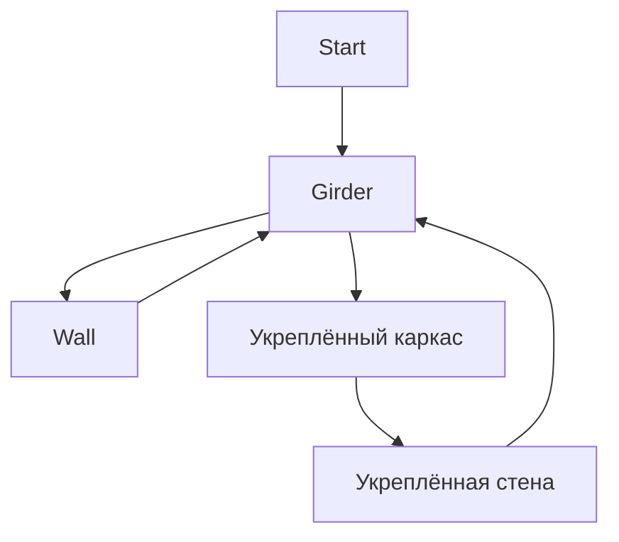

# Строительство
- Мощная
- Ориентированная на данные
- Управляемая событиями
- Полная по Тьюрингу
- Одобрено PJB[^1]
- Работает на теории графов и ИИ-поиске пути
- Написано тем же занудой, что подарил вам атмос и ботанику :^)

## Указатель TODO

- Введение в графы строительства
	- Объяснить концепцию графов, узлов, рёбер и шагов.
- Написание и проектирование графов строительства
  - Объяснить, как на самом деле писать и проектировать хороший граф.
- Список шагов, действий и условий.
- Написание начального строительства.
  - Объяснить ограничения.
- Как добавлять пользовательские шаги
- Внутреннее устройство системы строительства
  - Общий обзор того, как строительство работает изнутри.

## Граф строительства

Эта система строительства основана на убеждении, что любое сложное строительство в игре можно определить как [граф](https://en.wikipedia.org/wiki/Graph_theory) взаимосвязанных состояний, или **узлов**. Цель этой системы — облегчить проектирование и создание новых сложных взаимодействий (строительств) между сущностями, одновременно резко сокращая объём кода, который нужно написать, чтобы их обеспечить.

Графы состоят из **узлов** и связей между ними, называемых **рёбрами**.

**Граф строительства «Каркас»**



---
### Узлы

Узлы представляют текущее состояние сущности.
Сущность, имеющая граф строительства, всегда будет находиться в одном из узлов и может перемещаться между ними при определённых обстоятельствах, определённых рёбрами. 

#### Узлы и прототипы сущностей
Узлы могут указывать ID прототипа сущности. Сущность, прибывшая в узел, который указывает прототип, отличный от её собственного, будет удалена, а на её месте будет заспавнен указанный прототип сущности. Когда это происходит, каждый контейнер, принадлежащий `ConstructionComponent` сущности, будет передан новой сущности. 

```admonish info
Указанный прототип сущности ОБЯЗАН иметь `ConstructionComponent` с правильным графом и узлом.
```

#### Действия
Вы можете указать действия, которые будут выполнены, когда сущность прибывает в узел (неважно, прибывает ли она по ребру или заспавнена, уже находясь в узле).
Чтобы создать новое действие, нужно просто создать класс C#, реализующий `IGraphAction`.
Действия могут делать что угодно, от спавна другого прототипа до удаления самой сущности.

---
### Рёбра
Рёбра — это связи или переходы между узлами. Они определяют взаимодействия, необходимые для того, чтобы сущность перешла из одного узла в другой. 
#### Завершённые действия
Вы можете указать действия, которые будут выполнены, когда ребро завершается, прямо перед тем как сущность достигнет нового узла. Здесь используются те же классы, что и для действий узла, с `IGraphAction`. Вы можете создавать новые, реализовав этот интерфейс в новом классе C#.
#### Условия
Вы также можете указать условия, которые должны быть выполнены, чтобы ребро было доступно. Все они будут проверены перед началом и во время ребра. Вы можете создавать пользовательские действия, создав новый класс C#, реализующий `IEdgeCondition`.
#### Шаги
Шаги — это взаимодействия, необходимые для того, чтобы сущность перешла из одного узла в другой по ребру.
Ребро может указывать столько шагов, сколько требуется.
##### Шаг с инструментом
Этот шаг требует применить к сущности инструмент с нужным качеством.
##### Шаг с материалом
Этот шаг требует вставить в сущность произвольное количество материала.
    Он работает путём *разделения* стаков материала.
##### Шаг с компонентом
Этот шаг требует вставить сущность с определённым компонентом.
    Использовать этот шаг не возбраняется, но в большинстве случаев рекомендуется использовать вместо него теги.
##### Шаг с тегом
Этот шаг требует вставить сущность с определённым тегом.
##### Шаг с несколькими тегами
Этот шаг требует вставить сущность с рядом тегов, заданных через `allTags` и `anyTags`. `allTags` действует как вентиль `AND`, а `anyTags` — как вентиль `OR`. Вы сможете вставить только те сущности, которые удовлетворяют обоим требованиям. Вы можете указать только одно из двух или указать оба сразу.
#### Контейнеры
Любой шаг, требующий от пользователя внести предмет в строительство (шаги с материалом, прототипом и компонентом), может сохранить внесённый предмет в именованном контейнере на сущности. Когда сущность меняется из-за прибытия в узел с другим прототипом сущности, все эти контейнеры *будут переданы новой сущности*. Система строительства позволяет использовать этот сохранённый предмет для любых целей, например для извлечения данных из компонента сохранённого предмета для разных эффектов (смотрите граф строительства компьютера) или просто чтобы «сохранить» и позже вернуть тот же самый предмет, который внёс пользователь. 

---
### Прототип графа строительства

Ниже вы найдёте пример графа строительства, задокументированный для обучения написанию графов.
Реальные примеры смотрите в прототипах графов в коде игры.

```yaml
- type: constructionGraph

  # Идентификатор графа.
  id: ExampleGraph
  
  # Графы должны указывать начальный узел для целей поиска пути.
  # Все остальные узлы должны быть достижимы из этого.
  start: start
  
  # А теперь мы собственно определяем граф!
  graph:
  
    # Узлы определяются вот так.
    - node: start
    
      # Прототип сущности, указанный этим узлом.
      # Это превратит сущность в него, если он отличается.
      entity: MySpecialEntity
    
      # Узлы могут иметь действия, выполняемые при достижении узла.
      # Они выполняются в том порядке, в котором определены, сверху вниз.
      actions:
        # Действия без параметров указываются вот так.
        # Тип — это имя класса C#, реализующего IGraphAction.
        - !type:ExampleActionWithNoParameters {}
        
        # Действия могут указывать любые параметры, так как реализуют IExposeData.
        - !type:ExampleActionWithParameters
          foo: "bar"
          
        # Ниже вы найдёте все допустимые действия на момент написания.
        
        # Это действие просто проигрывает звук от сущности с вариацией высоты тона.
        - !type:PlaySound
          sound: /path/to/my/sound.ogg
          # Если указана коллекция звуков, "sound" игнорируется.
          soundCollection: mySoundCollection
          
          # Это действие показывает пользователю всплывающее окно.
        - !type:PopupUser
          # Показывается ли всплывающее окно на курсоре или на сущности.
          cursor: false
          text: "Hello, person who made me reach this node!"
          
          # Устанавливает значение якоря сущности.
        - !type:SetAnchor
          value: true
          
          # Привязывает сущность к тайлу, на котором она стоит.
        - !type:SnapToGrid
          offset: Center # или Edge. Смотрите enum SnapGridOffset.
          
          # Спавнит прототип сущности в месте нахождения сущности.
        - !type:SpawnPrototype
          # ID прототипа сущности. В данном случае один лист стали.
          prototype: SteelSheet1
          # Количество раз, которое он будет заспавнен
          amount: 5
          
          # Меняет спрайт сущности.
        - !type:SpriteChange
          # Слой для изменения. По умолчанию ноль.
          layer: 0
          # Спецификатор спрайта RSI+State.
          specifier:
            sprite: "My/special/sprite.rsi"
            state: "sample_state"
          # Спецификатор спрайта текстуры. Дублируется только в обучающих целях.
          specifier: "My/texture/somewhere.png"
          
          # Меняет состояние RSI слоя.
        - !type:SpriteStateChange
          # Слой для изменения. По умолчанию ноль.
          layer: 0
          state: "my_state"
          
          # Устанавливает данные визуализатора в int.
        - !type:VisualizerDataInt
          # Ключ (обычная строка или enum) данных.
          key: "enum.MyVisualizerVisuals.MyVisuals"
          # Собственно данные для установки.
          data: 1
        
          # Особое действие, создающее компьютер из платы компьютера
          # в определённом контейнере. Скорее всего, вы не захотите это использовать.
        - !type:BuildComputer
          # Контейнер, где находится плата компьютера. 
          container: "board"
          
          # Удаляет сущность! Действия после этого не выполняются.
        - !type:DeleteEntity {}
      
      # А теперь определяем рёбра!
      edges:
        # Это определяет ребро. "otherNode" — идентификатор другого узла.
        - to: otherNode
          # Здесь также принимаются действия, как выше.
          # Они будут выполнены при завершении ребра.
          completed:
            - !type:ExampleActionWithNoParameters {}
            
          # Рёбра также могут указывать условия.
          # Все они должны быть выполнены, чтобы ребро было доступно.
          # Они определяются аналогично действиям выше.
          conditions:
            - !type:ExampleConditionWithNoParameters {}
            
            # Ниже вы найдёте все условия на момент написания.
          
              # Условие, когда на тайле должна быть сущность с
              # компонентом, либо не должно быть сущностей с
              # определённым компонентом на тайле.
            - !type:ComponentInTile
              # Имя компонента.
              component: "myComponent"
              # Если true, любая сущность на тайле должна иметь компонент.
              # Если false, ни одна сущность на тайле не должна иметь компонент.
              hasEntity: true
              
              # Условие, когда контейнер на сущности должен быть пустым.
            - !type:ContainerEmpty
              container: "board"
              
              # Условие, когда сущность должна быть заякорена или не заякорена.
            - !type:EntityAnchored
              # состояние якоря, необходимое для выполнения условия
              anchored: false
              
              # Условие, когда панель проводов сущности должна быть открыта/закрыта.
            - !type:WirePanel
              # Состояние панели проводов для выполнения условия.
              open: true
    
      # А теперь определяем сами шаги этого ребра.
      steps:
      
      
        # Шаг с материалом. Требует вставить материал.
      - material: Glass # Любой из StackType.
        amount: 2
        # Если указан store, он сохранит материал в контейнере.
        # Если store не указан, он просто удалит его.
        store: myContainer
        # Все шаги могут иметь задержку do_after, в секундах.
        doAfter: 2
        # Все шаги также могут иметь завершённые действия, как и рёбра.
        # Они указываются так же, как и действия узла.
        # Они будут выполнены при завершении шага (после doAfter)
        completed:
        - !type:ExampleActionWithNoParameters {}
        
        
        # Шаг с инструментом. Требует применить к сущности инструмент.
      - tool: Screwing # Как указано в enum ToolQuality.
        doAfter: 0.25
        
        
        # Шаг с компонентом.
      - component: ComputerBoard # Принимает любые сущности с этим компонентом.
        # Контейнер, где будет храниться предмет.
        # Он будет удалён, если это не указано.
        store: board
        # Это имя будет использоваться в руководстве по строительству.
        name: Computer Board
        # Эта иконка будет использоваться в руководстве по строительству.
        # Использует SpriteSpecifier.
        icon: /Textures/My/Path/To/A/Texture.png
        
        
        # Шаг с прототипом. Требует вставить сущность, происходящую от
        # определённого прототипа. Ничего другого не принимает.
      - prototype: MyVerySpecificPrototype
        # Контейнер, где будет храниться предмет.
        # Он будет удалён, если это не указано.
        store: aCertainContainer
        # Это имя будет использоваться в руководстве по строительству.
        name: A Certain Item
        # Эта иконка будет использоваться в руководстве по строительству.
        # Использует SpriteSpecifier.
        icon:
          sprite: My/Path/To/A/Sprite.rsi
          state: MyState
      
      
        # Шаг с тегом. Требует вставить сущность с определённым тегом.
        # Ничего другого не принимает.
      - tag: MyVerySpecificTag
        # Контейнер, где будет храниться предмет.
        # Он будет удалён, если это не указано.
        store: anotherCertainContainer
        # Это имя будет использоваться в руководстве по строительству.
        name: Another Certain Item
        # Эта иконка будет использоваться в руководстве по строительству.
        # Использует SpriteSpecifier.
        icon: /Textures/I/Cant/Thing/Of/Anything.png
        
        
        # Шаг с несколькими тегами. Позволяет потребовать определённую конфигурацию тегов.
        
        # Сейчас я напишу несколько допустимых конфигураций шага с несколькими тегами
        # Имейте в виду, что шаги с несколькими тегами также могут указывать 
        # "store", "name", "icon" и "doAfter"! Я опущу их здесь 
        # для большей ясности...
        
        # Это потребует, чтобы сущность имела все теги ниже.
      - allTags:
          - MyTagOne
          - MyTagTwo
          
        # Это потребует, чтобы сущность имела любой из тегов ниже.
      - anyTags:
          - MyTagOne
          - MyTagTwo
          
        # Это потребует, чтобы сущность имела MyTagOne и либо
        # MyTagTwo, либо MyTagThree.
      - allTags:
          - MyTagOne
        anyTags:
          - MyTagTwo
          - MyTagThree
          
        # Это потребует, чтобы сущность имела MyTagOne и MyTagFour
        # и либо MyTagTwo, либо MyTagThree.
        # Как видите, вы можете располагать их в любом порядке!
      - anyTags:
          - MyTagTwo
          - MyTagThree
        allTags:
          - MyTagOne
          - MyTagFour
    
    # Мы можем определять сколько угодно узлов... Предел — только небо!
    - node: otherNode
    - node: anotherNode    
```

**TODO**: Перечислить и объяснить все действия/условия графов в списке где-нибудь.

## Прототип рецепта строительства

Чтобы указать рецепты строительства/крафта в меню строительства, нужно написать прототипы строительства.

```yaml
# Каркас
- type: construction

  # Понятное пользователю имя.
  name: girder
  
  # Идентификатор рецепта.
  id: girder
  
  # Идентификатор графа строительства.
  graph: girder
  
  # Узел, с которого мы начинаем рецепт. (Состояние призрака строительства)
  startNode: start
  
  # Узел, в который мы пытаемся попасть. Может быть любым узлом графа, если
  # к нему есть путь из начального узла.
  targetNode: girder
  
  # Понятная пользователю категория рецепта.
  category: Structures
  
  # Понятное пользователю описание, показываемое в меню.
  description: A large structural assembly made out of metal.
  
  # Спецификатор спрайта для рецепта. Показывается в меню.
  icon:
    sprite: /Textures/Constructible/Structures/Walls/solid.rsi
    state: wall_girder

  # Является ли это Структурой или Предметом.
  # В случае структуры будет размещён призрак строительства.
  # Затем пользователю нужно взаимодействовать с ним, чтобы начать строить.
  # В случае предмета пользователь пытается создать предмет напрямую из
  # предметов в руках, инвентаре и окружении.
  objectType: Structure
  
  # Режим размещения.
  placementMode: SnapgridCenter
  
  # То же, что условия ребра, но они проверяются перед строительством.
  conditions:
    - !type:ExampleConstrutionConditionWithNoParameters {}
    
    # Ниже вы найдёте все текущие условия строительства на момент написания.
    
    # Проверяет, есть ли низкая стена на тайле. Полезно для окон.
    - !type:LowWallInTile {}
    
    # Проверяет, нет ли окон на тайле. Полезно для низких стен.
    - !type:NoWindowsInTile {}
```

#### Начальное строительство
Что происходит, когда вы пытаетесь создать предмет или начать строить призрак строительства?
Система строительства попытается найти путь из начального узла в целевой узел.
Этот первый шаг в строительстве очень особенный. У него есть некоторые ограничения, которых нет у обычных рёбер.
Например, шаги с инструментом не допускаются, а условия рёбер не проверяются. По этой причине проектируйте начальный узел так, чтобы у него были ясные, простые рёбра без этих недопустимых возможностей. Завершённые действия шагов и рёбер, однако, разрешены. Все они выполнятся сразу, когда строительство завершится успешно.

**TODO**: Перенести это в объяснение меню строительства.

#### Условия строительства
Условия строительства должны быть классами C# в проекте Shared content.
Они реализуют `IConstructionCondition`.

**TODO**: Перечислить все текущие условия строительства.

## Меню строительства

**TODO**: Перенести объяснение прототипа строительства сюда.

**TODO**: Объяснить узел «start» и использовать пример графа стеклянного листа.

### Призраки строительства

**TODO**: Правильно объяснить начальное строительство.

### Крафт

**TODO**: Объяснить, как работают графы крафта предметов.

[^1]: PJB ужасно воняет.
