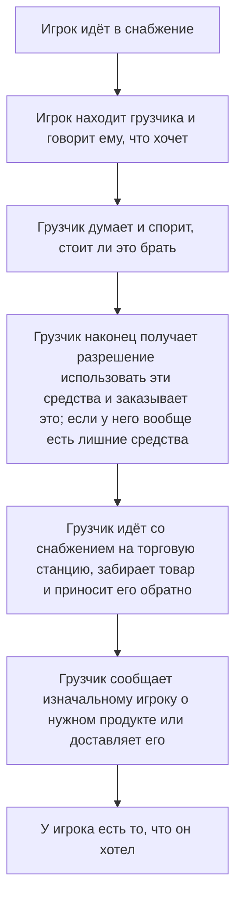
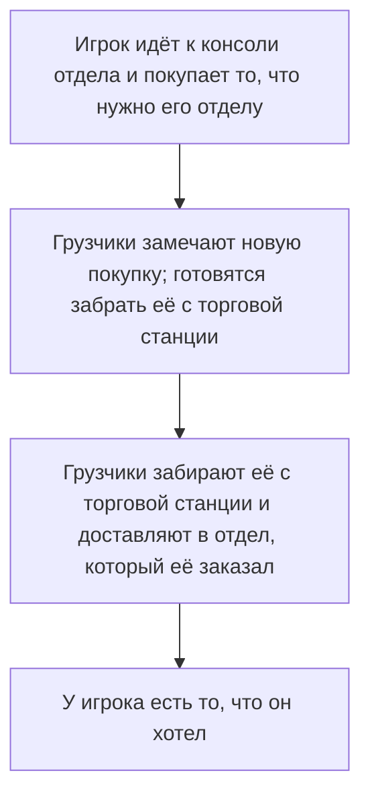

# Экономика отделов

| Дизайнеры | Реализовано | Ссылки на GitHub |
|---|---|---|
| mirrorcult | :x: Нет | TBD |

Цель этого предложения — создать систему экономических взаимодействий внутри игры, которая добавляет геймплей, повышает агентность игроков и отделов, а также открывает пути взаимодействия между игроками, которые ранее были невозможны. Вместо того чтобы втискивать экономику ради галочки и придумывать взаимодействия потом (ворчание-ворчание), реализация экономики здесь стремится решать реально существующие проблемы дизайна интуитивными способами, освобождая, а не ограничивая дизайнерское пространство в её взаимодействиях.

## Немного предыстории

Я здесь, чтобы убедить вас, что в текущем рабочем процессе снабжения существует проблема трения (в основном) независимо от таких вещей, как время поездки на торговую станцию / шаттле. Текущий игровой поток для игрока, который чего-то хочет, выглядит примерно так:

Каждый из этих шагов вносит потенциальное трение, потенциальную задержку, потенциальную возможность некомпетентности или провала и т. д. Это не *обязательно* плохо, но трения достаточно, чтобы люди либо просто не заморачивались, либо (справедливо) сильно злились, когда не могут что-то сделать из-за чего-то, что полностью вне их контроля.

## Проблемы

Есть несколько ключевых вопросов, на которых стоит сосредоточиться:
- Снабжению приходится быть посредником на нескольких разных этапах (запрос, покупка и доставка), хотя это не намного интереснее, чем если бы они были посредником в одной-единственной точке
- Необходимость для снабжения тратить свои деньги на покупки для других означает плохое совпадение стимулов с результатом, который мы на самом деле хотим (чтобы люди получали то, что запрашивают)--опять же, не *обязательно* фундаментальная проблема, но вносит серьёзное трение
- Поскольку практически каждый шаг, кроме попрошайничества, изолирован в снабжении, игроки в отделах чувствуют, что у них очень мало агентности в решениях о том, как добыть нужные им припасы

## Решения

Мы рассмотрим пару концепций, которые я хотел бы ввести для экономической системы, а затем вернёмся и посмотрим, как это влияет на общий поток для отдела, желающего обеспечить себя.

### Средства отделов

**Средства отделов** разбивают существующий ныне 'банковский счёт станции' на отдельные для каждого отдела. Снабжение, конечно, тоже получает свой банковский счёт, но также *сервис*, *наука*, *медицина*, *безопасность* и *инженерия*. Последствия этого обсуждаются далее.

### Децентрализованные закупки

Каждый отдел со своим банковским счётом теперь имеет *свой собственный* терминал закупок снабжения в своём отделе. Члены отдела могут выбирать, что заказать, а сделанные покупки объявляются на радиоканале отдела, а также на канале снабжения. Покупки совершаются за счёт средств отдела, который их заказал, то есть независимо от выбора, который могут сделать другие отделы.

Это не 'запрос' снабжению--когда покупка совершена, деньги списываются со счёта отдела, и заказ появится на торговой станции. Теперь задача снабжения — управлять этими заказами и правильно их доставлять, а не также принимать заказы и решать за всех, что покупать.

Снабжению, конечно, всё ещё разрешено покупать вещи для себя, если им хочется пошалить.

#### Продажа отделами через локбоксы

Конечно, один правомерный вопрос — как во всё это вписывается продажа. Есть пара потенциальных способов справиться с этим, но предлагаемый здесь — выдать каждому отделу набор *локбоксов* на старте раунда--неразрушимых контейнеров, которые просто запираются и отпираются доступом их отдела--которые, будучи принесёнными в снабжение и в итоге проданными, отдают 75% своей прибыли соответствующему отделу и 25% снабжению, чтобы стимулировать их действительно продавать то дерьмо, что им дают.

Когда снабжение продаёт что-то (не в локбоксе), 75% идёт снабжению, а 25% распределяется между другими отделами так же, как распределяется финансирование. Идеальный переход к следующему разделу!

### Исследовательское финансирование NT и его распределение

Поскольку деньги теперь будут более актуальны для всех, а продажа не является жизнеспособным источником дохода для многих отделов (таких как медицина или инженерия), я решил включить альтернативный источник денег, который отлично интегрируется с игрой, имеет забавные лорные последствия и по-прежнему сосредоточен вокруг взаимодействия игроков.

Этот источник — **исследовательское финансирование NanoTrasen**. Станция существует не просто так--предположительно это *исследовательская* станция, и она не может выполнять свою работу без некоторого исследовательского финансирования! 'Исследования' здесь относятся не конкретно к отделу, а к тому, для чего станция вообще существует. В моей концепции здесь цель станции — исследовать, насколько хорошо экипаж станции справляется под интенсивным давлением и опасностями как окружающей среды, так и внутренними. **Чем больше 'исследований' ведётся** (то есть, эм, чем опаснее станция), **тем больше исследовательского финансирования награждается**. Доведите её до края.

Каждые 10-15 минут (или любой другой произвольный интервал, вы поняли идею) NT будет оценивать, насколько опасна станция, на основе некоторых метрик, включая такие, как:
- Мёртвый / раненый экипаж
- Уничтоженные машины / нехватка энергии
- Количество угроз (аномалии, враждебные мобы и т. д.)

Чем опаснее станция, тем больше финансирования выделяется, вместе с некоторым флейвор-текстом, поздравляющим станцию или порицающим её, если было дано недостаточно. Если вызван аварийный шаттл, финансирование *приостанавливается* до отзыва шаттла, поскольку это рассматривается как то, что экипаж "завершает эксперимент". Если аварийный шаттл вызван ниже определённого уровня опасности или слишком рано, NanoTrasen может заставить вас заплатить в качестве компенсации.

Как определяется, куда идёт финансирование, спросите вы? Правомерный вопрос! С этой системой Глава персонала получит в своём офисе новую **консоль распределения финансирования**, с помощью которой можно определять процент, который каждый отдел получает от каждого вливания средств (а также от проданных грузов, упомянутых выше). По умолчанию она будет начинать с разумного разделения (с небольшой вариацией или, редко, сильной вариацией) на случай, если ГП нет (или он никогда не удосужится его изменить), которое выглядит следующим образом:

- медицина: **30%**
- инженерия: **25%**
- безопасность: **20%**
- наука: **15%**
- сервис: **10%**
- снабжение: **0%** -- ожидается, что снабжение зарабатывает деньги старым добрым спекулянтством

Ожидается, что ГП будет менять распределение со временем, когда станет ясно, какие отделы нуждаются в нём больше всего, или просто отдаст всё тому, кто, по мнению ГП, перестанет его доставать. Само собой разумеется, что эта консоль лишь ограничена по доступу и может быть изменена любым, кто взломает доступ, хотя ГП — её естественный владелец. Конечно, любые изменения легко отменить, пока их замечают, поскольку они применяются только тогда, когда финансирование или продажи действительно поступают. Эта система — и кнут, и пряник: наука хорошо работает? Дайте им бонус! Наука спамит морбами и отказывается их убирать? Эти деньги вместо этого достанутся сервису и клоуну, которые, вероятно, распорядятся ими лучше.

Когда поступает новый раунд финансирования и объявляется всем, также отображается распределение и точное количество средств, выделенных каждому отделу.

### Переводы и откачивание

Любой хорошей экономической системе нужен способ, чтобы средства действительно переходили из рук в руки. Эта система работает лучше всего, когда оставляет как можно больше на усмотрение игроков--в конце концов, именно это заставляет экономику работать в реальной жизни. Система финансирования и продажа обходят этот дизайнерский пункт, так как при текущем устройстве игры действительно нужен какой-то конечный источник и сток, но как можно больше всего остального должно происходить между реальными игроками. С точки зрения дизайна, переводы должны стремиться быть относительно свободными от трения и представлены игрокам как нечто, что приносит выгоду и с чем интересно взаимодействовать.

Используя ту же консоль, что и для покупки товаров отдела через снабжение, игроки могут вставить свою ID-карту и выбрать сумму средств для перевода другому отделу. С ID главы переводы неограниченны. С обычным ID отдела вы можете перевести не более ~20%(?) текущих средств с перезарядкой. Сумма и отправитель объявляются обоим отделам. Ожидается, что игроки будут заключать сделки в отыгрыше с другими отделами и использовать переводы как оплату за услуги или товары. Например:

- Инженерия может попросить немного щедрого финансирования у снабжения, которое решает удовлетворить запрос, и КМ переводит им дополнительные средства
- Медицина обещает оплату сервису, если ботаника сможет произвести для них определённое химическое вещество
- Безопасности ОЧЕНЬ срочно нужна медицинская помощь, и она обещает большие деньги, если медицина бросит своё неважное дерьмо и поможет

Что касается **откачивания**, идея в том, что консоль в хранилище сможет свободно снимать средства отделов в настоящие бумажные спесо--с некоторой задержкой по времени и объявлением для эффекта ограбления. Спесо можно вставить в любую соответствующую консоль закупок отдела/снабжения.

## Заключение

При целостной реализации изложенных здесь систем я вижу много преимуществ. Деньги всегда интересны игрокам для взаимодействия--им нравится чувствовать, что они получают большие прибыли или заключают тёмные сделки или что-то такое, так что интегрировать их со всеми — это хорошо. Игроки отделов получат гораздо больше агентности и будут гораздо меньше разочарованы тем, что некоторые вещи 'требуют' снабжения, поскольку трение при получении чего-либо от снабжения значительно снижается. Игроки снабжения будут испытывать гораздо меньше стресса, при этом сохраняя весёлые части своей работы и новое измерение в виде управления входящими покупками, о которых их не всегда явно уведомляли. С точки зрения дизайна, мы можем проектировать вокруг того, что отделы продают, покупают и заключают сделки между собой, не чувствуя, что обрекаем игроков на бесконечный ад без вариантов, если снабжение некомпетентно или медлительно. Я ожидаю, что вокруг переводов средств между отделами, а также выпрашивания отделами у ГП больше денег на свои любимые проекты, разовьётся весёлый отыгрыш и взаимодействия.

Возвращаясь к предыдущему примеру потока снабжения, вот как, я представляю, это будет выглядеть с данной реализацией:

Для наших целей намного лучше!

Некоторые потенциальные вещи, о которых придётся подумать при реализации всей этой системы:
- Цены снабжения почти наверняка придётся перебалансировать, теперь когда у снабжения гораздо больше агентности заказывать что угодно, не влияя на остальную станцию (поскольку у них будут свои средства)
- Награды, вероятно, потребуется несколько децентрализовать, чтобы отделы видели от них больше выгоды для себя
- В целом нужно ввести больше грузовых ящиков, раз будет больше предложения и заказываться будет больше вещей. Некоторые ящики, вероятно, также придётся убрать
- Снабжению понадобится больше геймплея, сосредоточенного вокруг доставки--было бы очень хорошо иметь какие-нибудь весёлые механики доставки, вроде более крутых MULE или тележек или чего-то такого
- Вероятно, мы захотим в целом сократить поставки определённых вещей по станции и просто ожидать, что отделы закажут что-то, если им нужно больше, вместо того чтобы давать им больше как костыль из-за слишком большого трения в снабжении

## Потенциальные будущие расширения

Это в основном просто вещи, о которых я слегка подумал, но не проработал в голове, и я не хочу раздувать объём работ

- Спекулятивные рынки для участия -- акции, процедурно генерируемые крипто-шиткоины и т. д. ПРОДОЛЖАЙТЕ ИГРАТЬ
- Отдельные торговые станции для разных рынков -- сомнительный рынок, где могут быть синдикатовцы, подпольный рынок, принимающий в качестве оплаты только крипто-шиткоины, поставщик еды, продающий только оптом, вот такого рода вещи
- Кредиты, которые отделы могут брать -- не можете вовремя выплатить кредит, к вам отправляют наёмников, чтобы раздробить коленные чашечки вашего отдела
- Бесстыдно украсть PTL из goonstation -- это просто очень хорошо и круто. [Почитайте](https://wiki.ss13.co/Power_Transmission_Laser)
- Пользовательские торговые автоматы из Eris, чтобы отделы зарабатывали дополнительные деньги, продавая вещи напрямую другим отделам, делая переводы ещё более свободными от трения
